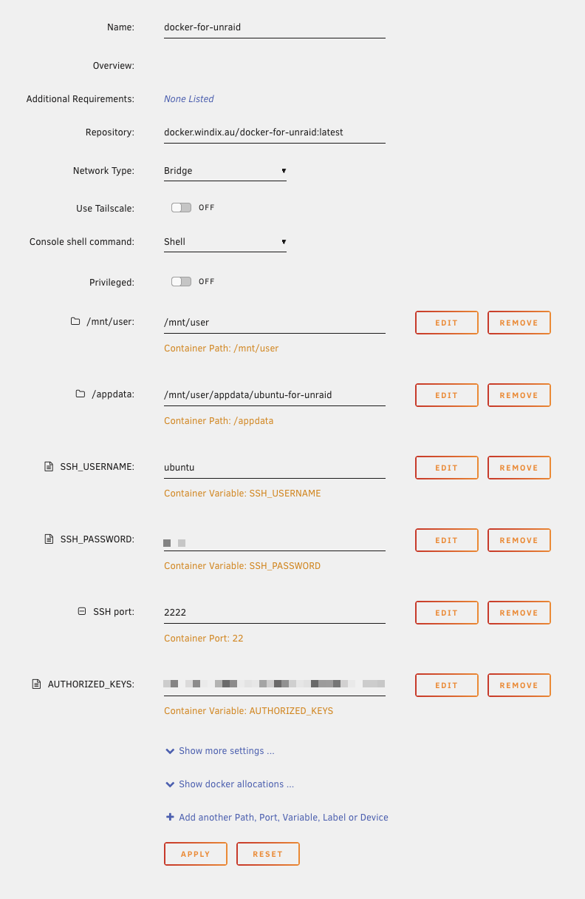

# Docker for Unraid

This is my personal customised ubuntu docker image running on unraid with the additional cli tools that doesn't shipped with unraid by default.

There are several reasons for this:

- Unraid's linux environment is based on now unpopular linux flavour Slackware
- Unraid has a custmisation to hide all user accounts and only allow root user to access SSH
- Every time with Unraid upgrade, all the customisation would be lost

## What included

The ubuntu Dockerfile is based on https://github.com/aoudiamoncef/ubuntu-sshd

- download tools: wget, curl, aria2c
- video tools: ffmpeg, mediainfo
- [BDInfoCLI-ng](https://github.com/zoffline/BDInfoCLI-ng)
- [VCS (video contact sheets)](https://github.com/outlyer-net/video-contact-sheet)
- youtube downloader [yt-dlp](https://github.com/yt-dlp/yt-dlp)
- my own ruby scripts

## Running with Unraid

See screenshot:



## Prerequisite

ruby scripts need be placed under `ruby-misc` folder

## bdinfo-cli

I have a separate [Dockerfile.dbinfo-build](./Dockerfile.bdinfo-build) to compile the bdinfo-cli from source code. But it turned the original author has provided a compiled version so this is no longer required. Just keep in the source code for reference.

```
docker build -t bdinfo-build -f Dockerfile.bdinfo-build .

docker run -it bdinfo-build

```
